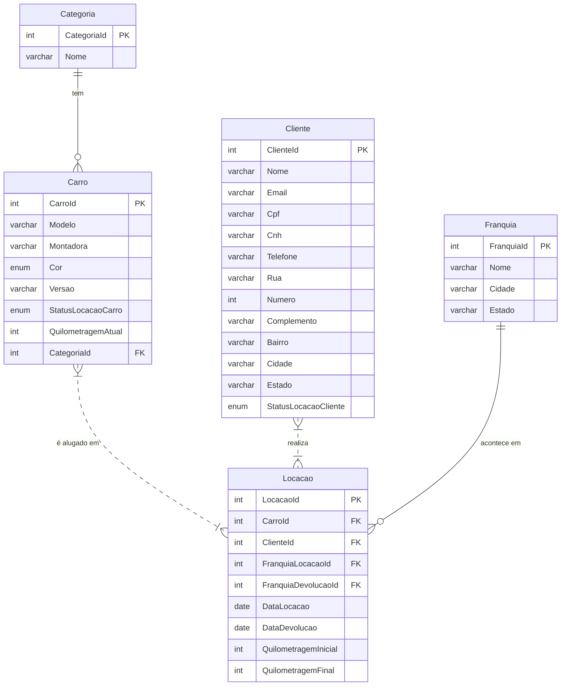

   

# Carloca Ada Tech

Este projeto foi desenvolvido em MySQL e envolve uma aplicação para uma locadora de carros chamada "Carloca". O sistema inclui tabelas que armazenam informações sobre categorias de carros, carros disponíveis, clientes, franquias e locações. Cada tabela possui campos específicos, como modelo de carro, nome do cliente e localização da franquia, permitindo o rastreamento e a gestão eficiente das operações de aluguel de carros, com integridade referencial e relacionamentos adequados entre as tabelas para garantir a consistência dos dados.

## :woman_mechanic: Linguagens e Ferramentas

   

## :paintbrush: Layout

- Histórico de clientes que locaram um carro específico

| Modelo | NomeCliente     | DataLocacao | DataDevolucao |
| ------ | --------------- | ----------- | ------------- |
| Ranger | Lucas Fernandes | 2023-05-12  | 2023-05-18    |
| Ranger | Ana Pereira     | 2023-12-23  |               |

- Histórico de carros alugados por um determinado cliente

| NomeCliente     | Modelo  | DataLocacao | DataDevolucao |
| --------------- | ------- | ----------- | ------------- |
| Lucas Fernandes | Ranger  | 2023-05-12  | 2023-05-18    |
| Lucas Fernandes | Mustang | 2023-08-20  | 2023-08-25    |

## :card_file_box: Tabelas

- [x] **Categoria**
    - [x] CategoriaId
    - [x] Nome

- [x] **Carro**
    - [x] CarroId
    - [x] Modelo
    - [x] Montadora
    - [x] Cor (Branco, Preto e Prata)
    - [x] Versao
    - [x] Status Locação Carro
    - [x] Quilometragem Atual
    - [x] CategoriaId

- [x] **Cliente**
    - [x] ClienteId
    - [x] Nome
    - [x] Email
    - [x] CPF
    - [x] CNH
    - [x] Telefone
    - [x] Rua
    - [x] Número
    - [x] Complemento
    - [x] Bairro
    - [x] Cidade
    - [x] Estado
    - [x] Status Locação Cliente

- [x] **Franquia**
    - [x] FranquiaId
    - [x] Nome
    - [x] Cidade
    - [x] Estado

- [x] **Locacao**
    - [x] LocacaoId
    - [x] CarroId
    - [x] ClienteId
    - [x] FranquiaLocacaoId
    - [x] FranquiaDevolucaoId
    - [x] Data Locação
    - [x] Data Devolução
    - [x] Quilometragem Inicial
    - [x] Quilometragem Final

## :clipboard: Requisitos Funcionais

- Um carro possui um modelo, uma montadora, uma cor e uma versão.
- As cores de carro disponíveis são apenas branco, preto e prata.
- Existem várias categorias de veículos.
- Um cliente só pode alugar um carro na modalidade "diária".
- Um cliente não pode alugar mais de um carro ao mesmo tempo.
- Enquanto um carro estiver alugado por um cliente, ele não pode ser oferecido a outro cliente.
- O sistema deve manter um histórico dos clientes que alugaram um determinado carro.
- O sistema deve rastrear o histórico de quantos quilômetros cada cliente percorreu com o carro, bem como a quilometragem atual de cada um dos carros.
- Existem várias unidades da franquia "CARLOCA", e o sistema deve registrar onde cada veículo foi alugado e onde foi devolvido.

## :twisted_rightwards_arrows: Diagrama de Relacionamento

## :woman_technologist: Desenvolvedora

| [ Christiane Barbosa](https://www.linkedin.com/in/christiane-barbosa/) |
| :----------------------------------------------------------------------------------------------------------------------------------: | 